<div align="center">


<a href="https://git.io/typing-svg">
  
</a>

<br/><br/>

<a href="https://www.linkedin.com/in/YOUR-LINKEDIN-ID/"></a>
<a href="mailto:shubhamwaghmode14@gmail.com"></a>


</div>


```cpp
struct Shubham {
    string role     = "CS student @ VIT Pune";
    string focus[3] = {"Full-stack systems", "LLM agents", "Applied ML"};
    string mindset  = "Build. Break. Understand. Repeat.";
    bool   coffee   = true;
};
```

## ⚙️ Stack

<div align="center">


<br/>

<br/>


</div>

## 🔒 Work

<div align="center">





</div>

## 📊 Numbers

<div align="center">


<br/>


<br/><br/>


</div>

## 🐍 Contributions

<div align="center">

<picture>
  <source media="(prefers-color-scheme: dark)" srcset="https://raw.githubusercontent.com/IamShubhamW/IamShubhamW/output/github-snake-dark.svg"/>
  
</picture>

</div>

## 🎯 Now

- Data structures & algorithms, daily
- LLM agents and evaluation
- Reading other people's code

<div align="center">


<sub><i>Think. Build. Evolve.</i></sub>

</div>
