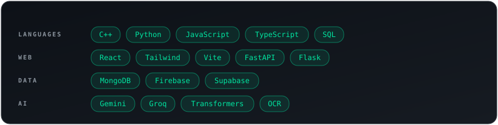

<picture>
  <source media="(prefers-color-scheme: dark)" srcset="https://raw.githubusercontent.com/IamShubhamW/IamShubhamW/output/github-snake-dark.svg"/>
  
</picture>

**[linkedin](https://www.linkedin.com/in/YOUR-LINKEDIN-ID/)** &nbsp;·&nbsp; **[shubhamwaghmode14@gmail.com](mailto:shubhamwaghmode14@gmail.com)**

